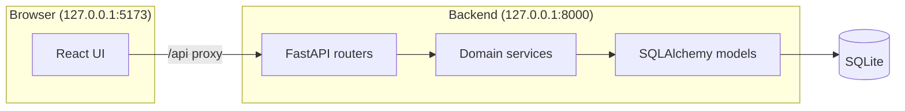

# Planforge

[](https://github.com/WUBBBZZZ/planforge/actions/workflows/ci.yml)

Self-hosted, **local-first** personal planning platform. Your tasks, routines,
appointments, and long-term maintenance live in a SQLite database on your
machine — not in a shared cloud service. Services bind to **127.0.0.1** only;
phone access and external networking are **not enabled**.

**Stack:** FastAPI · SQLAlchemy · Alembic · SQLite · React · TypeScript · Vite

## Architecture



| Layer | Responsibility |
|-------|----------------|
| **Views** | Today, Week, Month aggregation |
| **Entities** | Tasks, routines, appointments, maintenance |
| **Recurrence** | Calendar-aware occurrence generation |
| **Persistence** | SQLite + Alembic migrations |

## Technical highlights

- **Calendar-aware recurrence** — monthly routines clamp to month-end (Jan 31 → Feb 28); maintenance intervals use month/year semantics, not fixed day counts.
- **Separate maintenance model** — completions, scheduling reminders, and linked appointments are distinct but linkable records.
- **Appointment spans** — all-day and multi-day events appear on every occupied day in planner views.
- **OpenAPI-typed frontend** — committed `openapi.json` generates `schema.d.ts`; API client uses typed responses.
- **Verified backups** — SQLite `backup()` API, `integrity_check`, and isolated copy verification (`scripts/backup-sqlite.ps1`).

## Local-first privacy

- One installation = one database file on your computer.
- No telemetry, no cloud sync, no account system (authentication is planned).
- Development and documentation use **fabricated demo data only**.
- Secrets stay in untracked `.env`; databases and backups are never committed.

## Quick start (Windows / PowerShell)

### Backend

```powershell
cd backend
py -m venv .venv
.\.venv\Scripts\python.exe -m pip install -e ".[dev]"
.\.venv\Scripts\uvicorn.exe planforge.main:app --host 127.0.0.1 --port 8000
```

### Frontend

```powershell
cd frontend
npm install
npm run dev
```

Open `http://127.0.0.1:5173`. Today is at `/today`; maintenance at `/maintenance`.

Copy `.env.example` to `.env` for local configuration.

## Demo workflow (fabricated data)

1. Create a task due today → see it on **Today**.
2. Add a weekly routine → **sync occurrences** → complete one from **Week**.
3. Schedule an all-day appointment → see it on **Schedule** and **Month**.
4. Add maintenance (e.g. "Dentist demo") → mark completed → schedule next visit.
5. Run a verified backup: `.\scripts\backup-sqlite.ps1`

## Screenshots

Capture locally with fabricated data only:

```powershell
# Start backend + frontend, then open each route and screenshot:
# /today  /week  /schedule  /maintenance
```

## Known limitations

- Single-user only (no authentication yet).
- Loopback binding only — not reachable from phone or LAN.
- No offline PWA caching (service worker deferred).
- No arbitrary database import.
- Maintenance history board may require horizontal scroll for long histories.

## License

[MIT](LICENSE)
