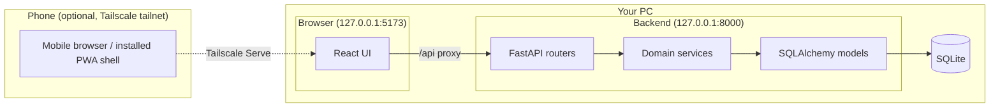

# Planforge

[](https://github.com/WUBBBZZZ/planforge/actions/workflows/ci.yml)

Self-hosted, **local-first** personal planning platform. Tasks, routines,
appointments, maintenance, backlog work, weekly targets, and packing lists live in
a SQLite database on your machine — not in a shared cloud service.

**Stack:** FastAPI · SQLAlchemy · Alembic · SQLite · React · TypeScript · Vite

## Design principles

| Principle | What it means in practice |
|-----------|---------------------------|
| **Local-first** | One SQLite database per installation on your computer |
| **Loopback by default** | Backend and dev frontend bind to `127.0.0.1` only |
| **Private phone access** | Optional Tailscale Serve on your tailnet — never public internet |
| **Single-user** | No account system yet; anyone who can reach the app has full access |
| **UI-driven policy** | Timezone, horizons, and planner behavior live in Settings |
| **Typed API contract** | OpenAPI schema generates the frontend TypeScript client |
| **Verified backups** | Operator backup script uses SQLite `backup()` + integrity checks |

## Repository structure

```text
PlanForge/
├── backend/                 FastAPI app, domain services, Alembic migrations, pytest
│   ├── planforge/           Application code (api, services, models, domain)
│   ├── alembic/             Schema migrations
│   ├── scripts/             Export OpenAPI, demo seed (fabricated data only)
│   └── tests/
├── frontend/                React + Vite UI, Vitest, ESLint, Prettier
│   ├── src/pages/           Planner and management screens
│   ├── src/components/      Shared UI, mobile shell, dialogs
│   ├── openapi/             Generated OpenAPI JSON (do not edit by hand)
│   └── src/api/schema.d.ts  Generated TypeScript types (do not edit by hand)
├── scripts/                 Operator scripts (SQLite backup)
├── .github/workflows/       CI on every push to `main`
├── .env.example             Configuration template (copy to `.env`)
└── README.md                This file
```

Operator-only files stay off the public repository:

- **Tracked `.gitignore`** — secrets, databases, dependencies, build output, caches
- **Local `.git/info/exclude`** (not committed) — private `docs/`, `.cursor/`,
  `backend/scripts/local/`, and other machine-specific paths

## Architecture



| Layer | Responsibility |
|-------|----------------|
| **Planner views** | Today, Week, Month aggregation |
| **Management pages** | Backlog, routines, schedule, maintenance, packing, settings |
| **Domain services** | Recurrence, maintenance lifecycle, appointments, capacity logic |
| **Persistence** | SQLite with Alembic migrations applied at startup |

### Domain entities (kept distinct)

- **Tasks** — scheduled work with due dates and completion state
- **Backlog items** — unscheduled work; promoting to a task preserves provenance
- **Routines** and **routine occurrences** — recurring definitions vs materialized instances
- **Routine groups** — organize routines for week/month display
- **Appointments** — fixed future events (including multi-day and all-day)
- **Maintenance definitions** and **completions** — long-term upkeep vs history of what happened
- **Scheduling reminders** — prompts to arrange maintenance; distinct from appointments
- **Weekly targets** — habit/goal counters for the current week
- **Packing lists** — reusable trip lists with items and questions

## Application routes

| Route | Purpose |
|-------|---------|
| `/week` | Default landing — weekly planner board |
| `/today` | Today's aggregated work |
| `/month` | Month calendar view |
| `/backlog` | Unscheduled items |
| `/routines` | Routine definitions and occurrence sync |
| `/schedule` | Appointments |
| `/maintenance` | Maintenance items and completion history |
| `/packing` | Packing lists |
| `/settings` | Timezone, horizons, and planner policies |

Mobile layout uses a bottom navigation bar and floating capture button on narrow
viewports. A web app manifest supports add-to-home-screen; there is no offline
service worker yet.

## Security and privacy

- Services bind to **`127.0.0.1`** by default. Do not expose to `0.0.0.0`, LAN, or
  the public internet without an explicit security review.
- **Tailscale Serve** on your private tailnet is the supported phone-access path.
  Tailscale is **not** authentication — anyone on the tailnet who can reach the URL
  has full planner access.
- Do **not** enable Tailscale Funnel, router port forwarding, or other public
  exposure.
- Never commit `.env`, database files, backups, or personal exports. The tracked
  `.gitignore` protects common paths; add machine-specific patterns to
  `.git/info/exclude` locally.
- No telemetry, cloud sync, or multi-tenant hosting.

## Prerequisites

- Windows 11 with PowerShell
- Python 3.14+ (backend uses a project-local `.venv`)
- Node.js 24+ and npm (frontend)

## Quick start (Windows / PowerShell)

### 1. Configuration

```powershell
Copy-Item .env.example .env
```

Edit `.env`:

- Set `PLANFORGE_SECRET_KEY` to a generated value:
  `py -c "import secrets; print(secrets.token_urlsafe(32))"`
- Set `PLANFORGE_TIMEZONE` to your IANA timezone (bootstrap default for first run)
- Leave `PLANFORGE_HOST=127.0.0.1` unless you have reviewed the security impact

### 2. Backend

```powershell
Set-Location backend
py -m venv .venv
.\.venv\Scripts\python.exe -m pip install -e ".[dev]"
.\.venv\Scripts\uvicorn.exe planforge.main:app --host 127.0.0.1 --port 8000
```

Alembic migrations run automatically on startup. The default database path is
`data/planforge.db` (created on first run; ignored by Git).

### 3. Frontend

In a second terminal:

```powershell
Set-Location frontend
npm install
npm run dev
```

Open `http://127.0.0.1:5173`.

### 4. Optional demo data

Use only with a fresh or disposable database:

```powershell
Set-Location backend
.\.venv\Scripts\python.exe scripts\seed_demo_tasks.py
```

Never run seed scripts against a live personal database without reviewing what
they create.

## Phone access (Tailscale Serve)

Use this when you want to open Planforge on your phone while the PC stays on and
the app keeps running locally.

1. Start backend and frontend as above (both on loopback).
2. Ensure your phone and PC are on the same Tailscale tailnet.
3. On the PC, proxy the Vite dev server (frontend proxies `/api` to the backend):

```powershell
tailscale serve --bg http://127.0.0.1:5173
tailscale serve status
```

4. Open the `*.ts.net` HTTPS URL shown on your phone.
5. To stop serving:

```powershell
tailscale serve reset
```

The Vite dev server allows `.ts.net` hostnames when proxied through Tailscale.
This is a **development** workflow — not a production deployment package.

## Backup and restore

Before relying on Planforge for real personal data:

1. Stop the backend (no active writers during backup).
2. Run a verified backup:

```powershell
.\scripts\backup-sqlite.ps1
```

Backups are written to `backups/` by default (ignored by Git). The script uses
SQLite's online backup API, runs `integrity_check`, and verifies the copy in an
isolated temporary database.

To restore: stop the backend, copy a verified backup over your database file (or
update `PLANFORGE_DATABASE_URL` to point at the restored file), then restart and
confirm the app loads.

## Development workflow

PlanForge uses a simple owner-operated Git workflow:

- Work on **`main`** by default
- Do not commit secrets, databases, backups, or personal exports
- Run relevant checks before pushing:

**Backend** (from `backend/`):

```powershell
.\.venv\Scripts\python.exe -m ruff format --check .
.\.venv\Scripts\python.exe -m ruff check .
.\.venv\Scripts\python.exe -m mypy planforge
.\.venv\Scripts\python.exe -m pytest
```

**Frontend** (from `frontend/`):

```powershell
npm run format:check
npm run lint
npm run typecheck
npm run test
npm run build
```

CI runs these checks (plus dependency audits and OpenAPI drift detection) on
every push to `main`.

### Regenerating API types

When backend API shapes change:

```powershell
Set-Location backend
.\.venv\Scripts\python.exe scripts\export_openapi.py
Set-Location ..\frontend
npm run generate:api-types
```

Commit both `frontend/openapi/openapi.json` and `frontend/src/api/schema.d.ts`.
Generated OpenAPI artifacts are excluded from Prettier; formatting is defined by
the export and generation tools.

## Technical highlights

- **Calendar-aware recurrence** — monthly routines clamp to month-end (Jan 31 → Feb 28); maintenance intervals use month/year semantics, not fixed day counts
- **Separate maintenance model** — completions, scheduling reminders, and linked appointments are distinct but linkable records
- **Appointment spans** — all-day and multi-day events appear on every occupied day in planner views
- **OpenAPI-typed frontend** — API client uses generated `schema.d.ts`
- **Mobile shell** — responsive layout, bottom nav, installable manifest; offline caching deferred

## Known limitations

- Single-user only — no authentication yet
- Loopback binding by default; LAN and public internet exposure are not supported
- Tailscale phone access requires the PC to remain on with backend and frontend running
- Installable PWA shell only — no service worker or offline data strategy yet
- No arbitrary database import
- Maintenance history board may require horizontal scroll for long histories
- AI assistance is optional and advisory when introduced; core planning logic stays deterministic

## License

[MIT](LICENSE)
