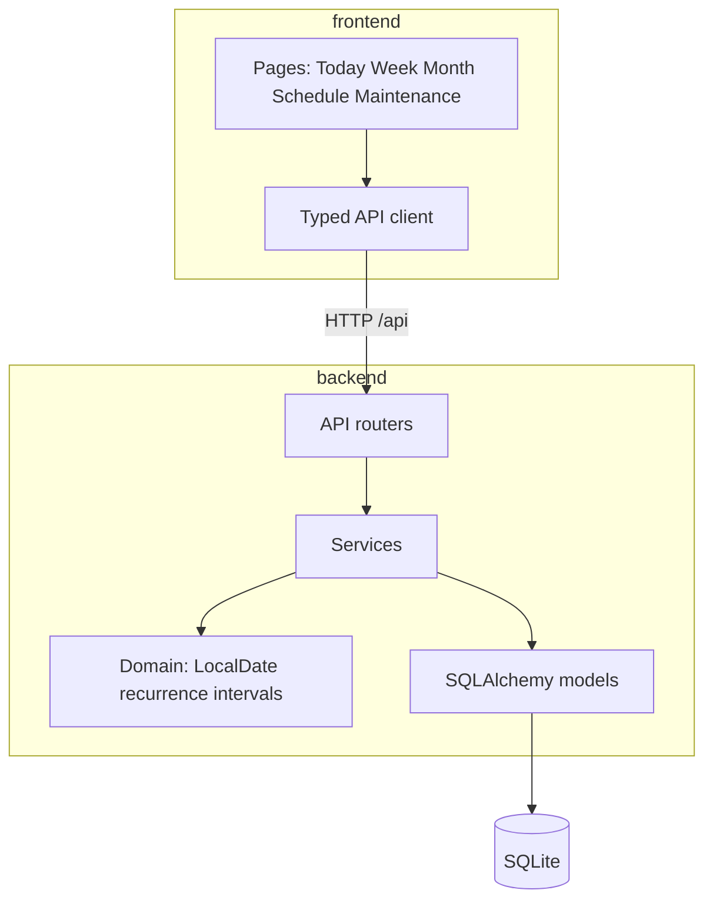

# Planforge Architecture

## Overview

Planforge is a local-first, self-hosted planning platform delivered as a
monorepo:

| Component | Stack | Status |
|-----------|-------|--------|
| `backend/` | FastAPI, SQLAlchemy, Alembic, SQLite | **Implemented** |
| `frontend/` | React, TypeScript, Vite | **Implemented** |
| `docs/` | ADRs, setup, security, backup | **Active** |

## Principles

- **End-user program:** planner behavior is configured through the UI, not source
  code or environment variables.
- **Local-first:** each installation is independent; no shared cloud service.
- **Security by default:** loopback binding until authentication; no public
  exposure; secrets only in untracked `.env`.
- **SQLite default:** fully supported for personal self-hosting.
- **Vertical slices:** features ship end-to-end (domain → persistence → API → UI).
- **Single-user first, multi-user-ready:** UUID keys and ownership columns from
  the start.

## API surface

| Router | Prefix | Purpose |
|--------|--------|---------|
| health | `/api/health` | Liveness |
| tasks | `/api/tasks` | Task CRUD and lifecycle |
| backlog | `/api/backlog` | Someday capture |
| routines | `/api/routines` | Recurring obligations |
| appointments | `/api/appointments` | Scheduled events |
| maintenance | `/api/maintenance` | Long-term upkeep |
| weekly-targets | `/api/weekly-targets` | Weekly habits |
| settings | `/api/settings` | Planner policies |
| views | `/api/views` | Today, Week, Month |

OpenAPI schema: committed at `frontend/openapi/openapi.json`. Regenerate with
`backend/scripts/export_openapi.py`.

## Recurrence design

- **Weekly routines** use weekday + `interval_weeks` with an anchor date.
- **Monthly routines** target a calendar day; short months clamp (day 31 → last
  day of month).
- **Occurrence horizon** is policy-driven; occurrences are not backfilled before
  routine start.
- **Maintenance intervals** use `days` / `weeks` / `months` / `years` / `manual`
  with calendar month arithmetic for month/year units.

## Data model highlights

- **Tasks** — due dates, completion, backlog promotion.
- **Routines + occurrences** — generated pending rows within horizon.
- **Appointments** — timed or all-day; optional link to maintenance.
- **Maintenance** — definitions, completion history, scheduling reminders,
  optional linked appointment (unique FK).

## Frontend

- Path-based routing in `App.tsx` (no client-side router dependency).
- Vite dev server proxies `/api` to the backend on loopback.
- OpenAPI-generated types wired through `src/api/client.ts`.

## Decision records

See [`decisions/`](decisions/) for numbered ADRs.

## Related docs

- [Feature status](feature-status.md)
- [Roadmap](roadmap.md)
- [Backup](backup.md)
- [Security](security.md)
