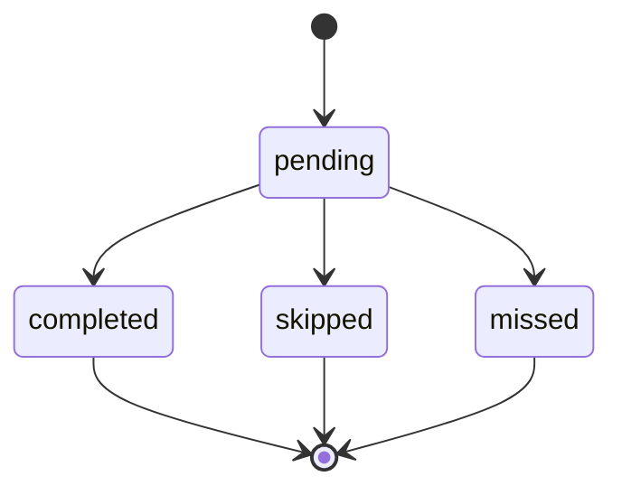

# Lifecycle states

States and allowed transitions per entity type. Implementation must enforce
transitions in domain logic (user-written); API should reject invalid transitions.

## Task

| State | Meaning |
|-------|---------|
| `pending` | Not completed; may have due date |
| `completed` | Done; completion record written |
| `cancelled` | User discarded; no longer appears in active views |

**Transitions:**

- `pending` → `completed` (user completes)
- `pending` → `cancelled` (user deletes/cancels)
- `completed` and `cancelled` are terminal for MVP (no un-complete in MVP)

**Rollover:** A pending task past due may appear in Today per policy; state
remains `pending` until completed or cancelled.

## Backlog item

| State | Meaning |
|-------|---------|
| `active` | In backlog |
| `promoted` | Moved to task, appointment, or routine (link to new entity) |
| `archived` | Removed from backlog without promotion |

**Transitions:**

- `active` → `promoted` (promotion action)
- `active` → `archived`
- `promoted` and `archived` are terminal

## Appointment

| State | Meaning |
|-------|---------|
| `scheduled` | Future or current obligation |
| `completed` | User attended / finished |
| `cancelled` | User cancelled |

**Transitions:**

- `scheduled` → `completed`
- `scheduled` → `cancelled`

Past `scheduled` appointments may surface as "missed" in UI without a separate
state if policy says so — **DECISION NEEDED** vs explicit `missed` state.

## Routine definition

| State | Meaning |
|-------|---------|
| `active` | Generates occurrences |
| `paused` | No new occurrences until resumed |
| `archived` | Historical only |

**Transitions:**

- `active` ↔ `paused`
- `active` or `paused` → `archived`

Editing an active routine does not rewrite past occurrences; future generation
uses the new definition.

## Occurrence

| State | Meaning |
|-------|---------|
| `pending` | Expected; not yet actioned |
| `completed` | User completed |
| `skipped` | User explicitly skipped |
| `missed` | System or user marked missed per policy |

**Transitions:**

- `pending` → `completed` | `skipped` | `missed`
- Terminal states for MVP

**DECISION NEEDED:** Can `missed` → `completed` retroactively (late complete)?

## Maintenance definition

Same pattern as routine: `active` | `paused` | `archived`.

Maintenance **due instance** (may mirror occurrence states): `due` | `completed`
| `skipped`.

## Weekly target

| State | Meaning |
|-------|---------|
| `active` | Current week goal |
| `met` | Threshold reached |
| `unmet` | Week ended below threshold |

Computed from completion records + target definition; may not need persisted
state beyond progress counters.

## Completion record

Append-only. No transitions — records are never updated or deleted in MVP
(export/analytics may read them).

## State diagram (occurrence)

