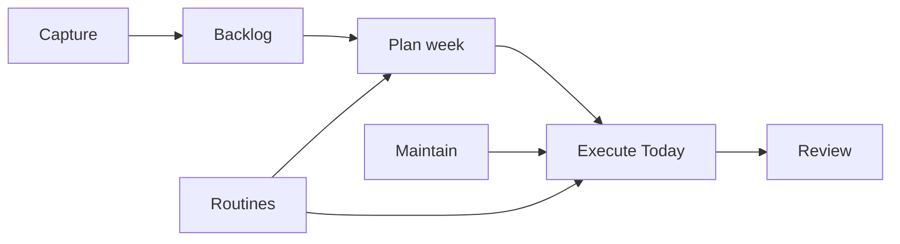

# User workflows

High-level flows Planforge must support. Each maps to acceptance criteria in
[acceptance-criteria.md](acceptance-criteria.md).

## 1. Capture

**Goal:** Get something out of the user's head quickly without deciding when it
happens.

| Step | Actor | Action |
|------|-------|--------|
| 1 | User | Opens capture entry (global shortcut or nav — MVP: simple form) |
| 2 | User | Enters title; optionally category, tags, notes |
| 3 | User | Chooses destination: **Backlog**, **Today task**, or **Appointment** |
| 4 | System | Persists entity; shows confirmation without leaving context |

**Out of scope for capture MVP:** voice input, email ingestion, natural-language
parsing.

## 2. Plan the week

**Goal:** Decide what the coming week should contain.

| Step | Actor | Action |
|------|-------|--------|
| 1 | User | Opens Week view for selected week |
| 2 | User | Reviews backlog sidebar/list |
| 3 | User | Promotes backlog items to dated tasks or assigns to days |
| 4 | User | Sets or adjusts weekly targets |
| 5 | User | Reviews generated routine occurrences for the week |
| 6 | System | Persists schedule changes; reflects policy defaults (visibility) |

## 3. Execute the day (Today)

**Goal:** Work through what matters today.

| Step | Actor | Action |
|------|-------|--------|
| 1 | User | Opens Today view (default landing after MVP) |
| 2 | System | Assembles list per visibility policies: tasks due today, today's occurrences, appointments, rolled items |
| 3 | User | Completes, skips, or defers items |
| 4 | System | Writes completion records; applies missed/rollover policies where configured |
| 5 | User | Optionally captures new items inline |

## 4. Review and adjust

**Goal:** Periodic reflection without rewriting history.

| Step | Actor | Action |
|------|-------|--------|
| 1 | User | Opens history or week summary (MVP: simple completion list) |
| 2 | User | Sees completed / missed / skipped counts for fabricated demo period |
| 3 | User | Adjusts routines, maintenance definitions, or policies in settings |
| 4 | System | Future occurrences reflect definition changes; past completion records unchanged |

## 5. Maintain long-horizon items

**Goal:** Track infrequent maintenance without cluttering daily views.

| Step | Actor | Action |
|------|-------|--------|
| 1 | User | Defines maintenance item with interval |
| 2 | System | Computes next due date (per ADR 0006 date rules) |
| 3 | User | Completes maintenance when due |
| 4 | System | Reschedules next due date; logs completion |

## Workflow dependencies

## DECISION NEEDED

- **Default landing view after MVP:** Today vs Week?
- **Capture UX:** modal vs dedicated page vs inline on Today?
